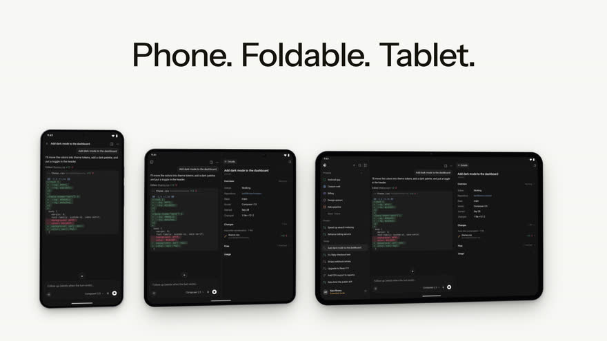

# Cursor for Android

Unofficial native Android client for [Cursor Cloud Agents](https://cursor.com/agents). Kotlin and Jetpack Compose. Not affiliated with Anysphere, Inc.

<p align="center">
  
</p>

Sign in with your Cursor account, or paste an API key. Launch agents, follow them live, and ship pull requests from your phone.

## Install

[Latest release](https://github.com/BenItBuhner/cursor-for-android/releases/latest) — install the APK. Allow unknown apps if Android asks. Android 8+.

## Build

JDK 17+, Android SDK 36.

```bash
./gradlew :app:assembleDebug
adb install -r app/build/outputs/apk/debug/app-debug.apk
```

`./gradlew :app:agentCheck` is the short pre-push test. CI, screenshots, and release signing live under `.github/` and `scripts/`.

Uses the public [Cloud Agents API](https://cursor.com/docs/cloud-agent/api/endpoints). Settings has an optional Extended mode for unofficial account endpoints; it is off by default.

## License

[MIT](LICENSE) © 2026 Bennett Buhner
